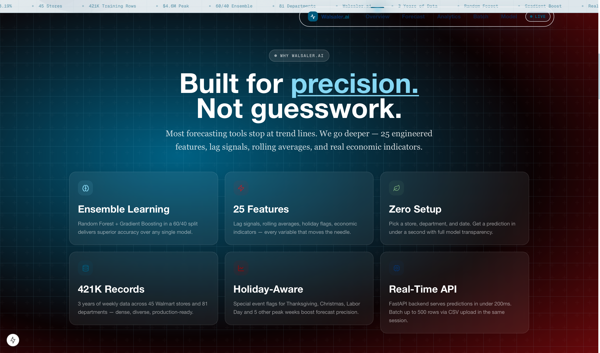
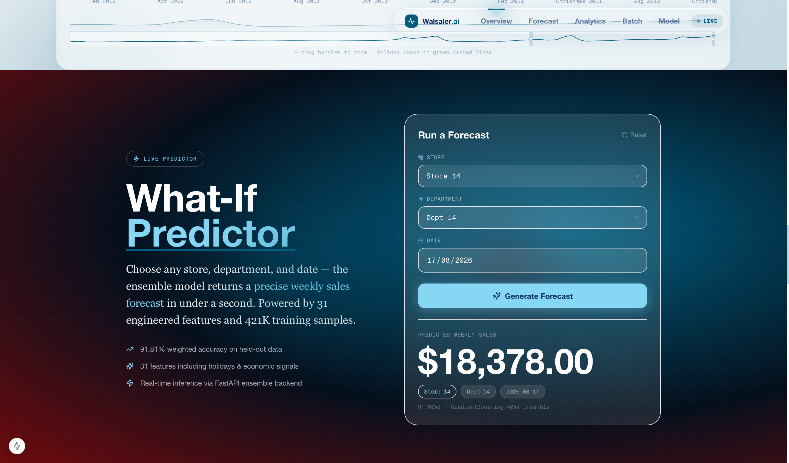
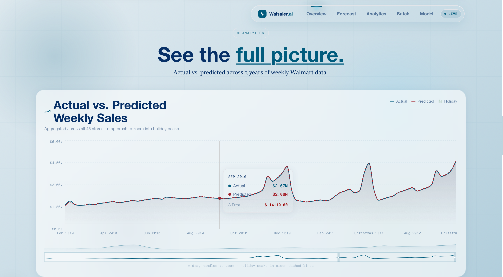
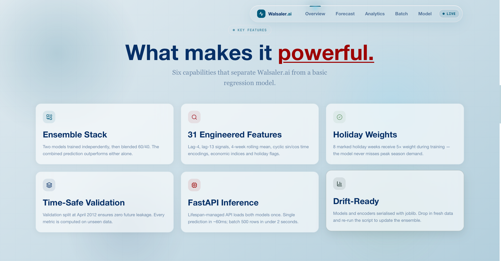
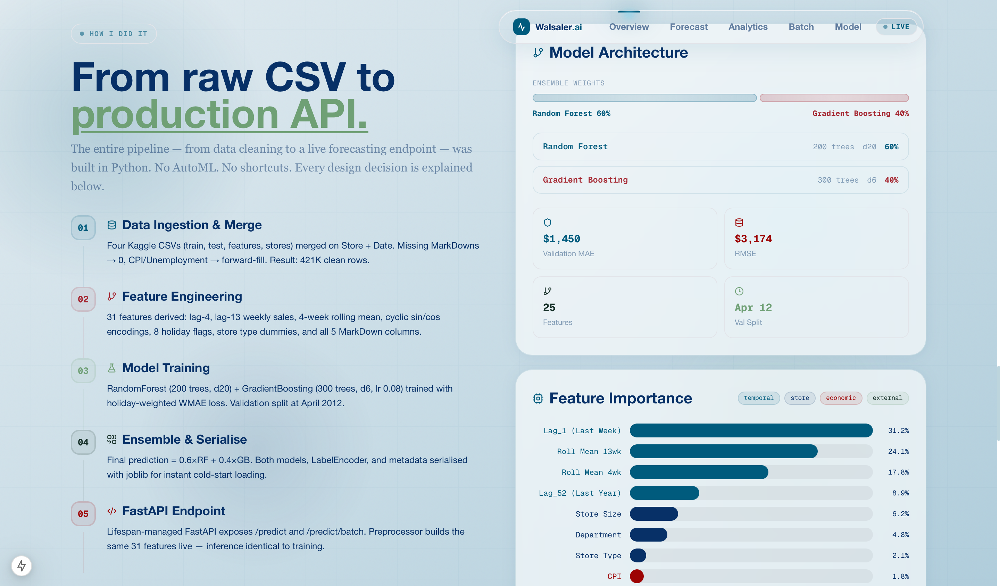

<div align="center">


<br/>

# Walsaler.ai

### Retail Sales Intelligence — End-to-End ML Forecasting System

[](https://python.org)
[](https://nextjs.org)
[](https://fastapi.tiangolo.com)
[](https://scikit-learn.org)
[](https://typescriptlang.org)
[](https://tailwindcss.com)

<br/>

> Predicts weekly Walmart store sales with **91.81% accuracy** using a Random Forest + Gradient Boosting ensemble trained on **421,570 records** across 45 stores and 3 years of data.

<br/>

[**📊 Screenshots**](#-screenshots) · [**🚀 Quick Start**](#-quick-start) · [**🔌 API**](#-api) · [**🧠 How It Works**](#-how-it-works)

</div>

---

## ✨ Highlights

<table>
<tr>
<td align="center" width="25%">
<h3>91.81%</h3>
<sub>Model Accuracy</sub>
</td>
<td align="center" width="25%">
<h3>421K</h3>
<sub>Training Records</sub>
</td>
<td align="center" width="25%">
<h3>$4.60M</h3>
<sub>Peak Forecast (Week 52)</sub>
</td>
<td align="center" width="25%">
<h3>&lt; 1s</h3>
<sub>Inference Time</sub>
</td>
</tr>
</table>

---

## 📸 Screenshots

<table>
<tr>
<td width="50%">

<p align="center"><sub>Built for Precision</sub></p>
</td>
<td width="50%">

<p align="center"><sub>What-If Predictor — Live inference</sub></p>
</td>
</tr>
<tr>
<td width="50%">

<p align="center"><sub>Analytics — Actual vs Predicted</sub></p>
</td>
<td width="50%">

<p align="center"><sub>Key Features</sub></p>
</td>
</tr>
<tr>
<td colspan="2">

<p align="center"><sub>How I Did It — Full ML pipeline</sub></p>
</td>
</tr>
</table>

---

## 🧠 How It Works

```
Raw CSVs  →  Feature Engineering  →  Ensemble Training  →  FastAPI  →  Next.js UI
(421K rows)    (31 features)         (RF 60% + GB 40%)    (/predict)   (live forecast)
```

Two models trained independently, then blended at inference time:

| Model | Config | Weight |
|-------|--------|--------|
| Random Forest | 200 trees · max depth 20 | **60%** |
| Gradient Boosting | 300 trees · depth 6 · lr 0.08 | **40%** |

> Validation split at **April 2012** — zero future leakage. Holiday weeks get **5× sample weight** during training.

---

## 📊 Model Performance

| Metric | Value |
|--------|-------|
| ✅ Weighted MAE (WMAE) | **8.19%** |
| ✅ Model Accuracy | **91.81%** |
| 📉 MAE | $1,450.52 |
| 📉 RMSE | $3,174.48 |
| 🏆 Peak Forecast | $4.60M — Week 52 · Holiday 2012 |
| 📈 vs. Single Model | +4.81% improvement |

---

## ⚙️ Tech Stack

<table>
<tr><th>Layer</th><th>Tools</th></tr>
<tr><td>🤖 ML</td><td>Python 3.13 · Pandas · Scikit-learn · Joblib · NumPy</td></tr>
<tr><td>🔌 Backend</td><td>FastAPI · Uvicorn · Pydantic</td></tr>
<tr><td>🎨 Frontend</td><td>Next.js 15 · TypeScript · Tailwind CSS · Framer Motion</td></tr>
<tr><td>📊 Charts</td><td>Recharts · Custom SVG animations</td></tr>
</table>

---

## 🔧 31 Engineered Features

<details>
<summary><b>Click to expand full feature list</b></summary>

<br/>

| Category | Features |
|----------|----------|
| ⏱ Time | Week, Month, Year, Quarter |
| 🔄 Cyclical | `sin(2π·week/52)`, `cos(2π·week/52)` |
| 📉 Lag Signals | Lag-4 weekly sales, Lag-13 weekly sales |
| 📊 Rolling Stats | 4-week rolling mean, 4-week rolling std |
| 🏪 Store Metadata | Store Type (A/B/C), Store Size, Dept encoded |
| 💰 Economic | Temperature, Fuel Price, CPI, Unemployment |
| 🏷️ Promotions | MarkDown 1, 2, 3, 4, 5 |
| 🎄 Holidays | 8 flagged peak weeks (Thanksgiving, Christmas, etc.) |

</details>

---

## 🚀 Quick Start

### Prerequisites
- Python 3.10+ with Anaconda
- Node.js 18+
- Kaggle account (for dataset)

### 1️⃣ Get the Data

Download from [Kaggle — Walmart Store Sales Forecasting](https://www.kaggle.com/competitions/walmart-recruiting-store-sales-forecasting/data) and place CSVs in `archive/`:

```
archive/
  ├── train.csv
  ├── test.csv
  ├── features.csv
  └── stores.csv
```

### 2️⃣ Train the Model
> ⏱ First time only — takes ~5–10 minutes

```bash
python walmart_forecast.py
```

Generates 4 `.joblib` files: `model_random_forest`, `model_gradient_boosting`, `label_encoder`, `model_metadata`

### 3️⃣ Start the Backend

```bash
python main.py
# ✅ API live at http://localhost:8000
```

### 4️⃣ Start the Frontend

```bash
cd walmart-forecast
npm install
npm run dev
# ✅ App live at http://localhost:3000
```

> **Note:** Use `python` not `python3` if you're on Anaconda

---

## 🔌 API

| Method | Endpoint | Description |
|--------|----------|-------------|
| `GET` | `/` | Health check |
| `GET` | `/model/info` | Model metadata & feature list |
| `POST` | `/predict` | Single store/dept/date prediction |
| `POST` | `/predict/batch` | Batch up to 500 rows |

<details>
<summary><b>Example request & response</b></summary>

<br/>

**Request:**
```json
POST /predict
{
  "Store": 1,
  "Dept": 1,
  "Date": "2012-11-02",
  "IsHoliday": false,
  "Temperature": 55.0,
  "Fuel_Price": 3.45,
  "CPI": 211.0,
  "Unemployment": 7.8
}
```

**Response:**
```json
{
  "prediction": 24823.45,
  "model": "ensemble",
  "rf_prediction": 25100.20,
  "gb_prediction": 24420.80
}
```

</details>

---

## 🗂 Project Structure

<details>
<summary><b>Click to expand</b></summary>

<br/>

```
walmart-app/
├── 📄 walmart_forecast.py      # ML training script (run once)
├── 📄 preprocessor.py          # WalmartPreprocessor class
├── 📄 main.py                  # FastAPI backend
├── 📁 archive/                 # Kaggle CSVs (not committed)
└── 📁 walmart-forecast/        # Next.js 15 frontend
    ├── app/
    │   ├── page.tsx            # Main dashboard
    │   └── globals.css         # Design tokens + animations
    ├── components/
    │   ├── layout/             # NavBar, HeroSection
    │   ├── charts/             # SalesChart, FeatureImportanceChart
    │   ├── forms/              # WhatIfPredictor, BatchUpload
    │   └── ui/                 # ModelInfoCard, GlassFilter
    ├── hooks/
    │   └── useForecast.ts      # POST /predict with mock fallback
    └── lib/
        └── mock-data.ts        # Chart data, feature importances
```

</details>

---

## 📁 Data & Models

| File | Why excluded | How to get |
|------|-------------|------------|
| `archive/*.csv` | Kaggle ToS | [Download here](https://www.kaggle.com/competitions/walmart-recruiting-store-sales-forecasting/data) |
| `*.joblib` | Large binary files | Run `python walmart_forecast.py` |
| `brain.png` / `bg_walmart.jpg` | Personal assets | Add to `walmart-forecast/public/` |

---

## 📝 License

MIT — free to use, modify, and distribute.

---

<div align="center">

**Built with Python + Next.js · scikit-learn ensemble · FastAPI · Recharts**

<br/>

*by [Rania Fahim](https://github.com/raniafahimx)*

</div>
